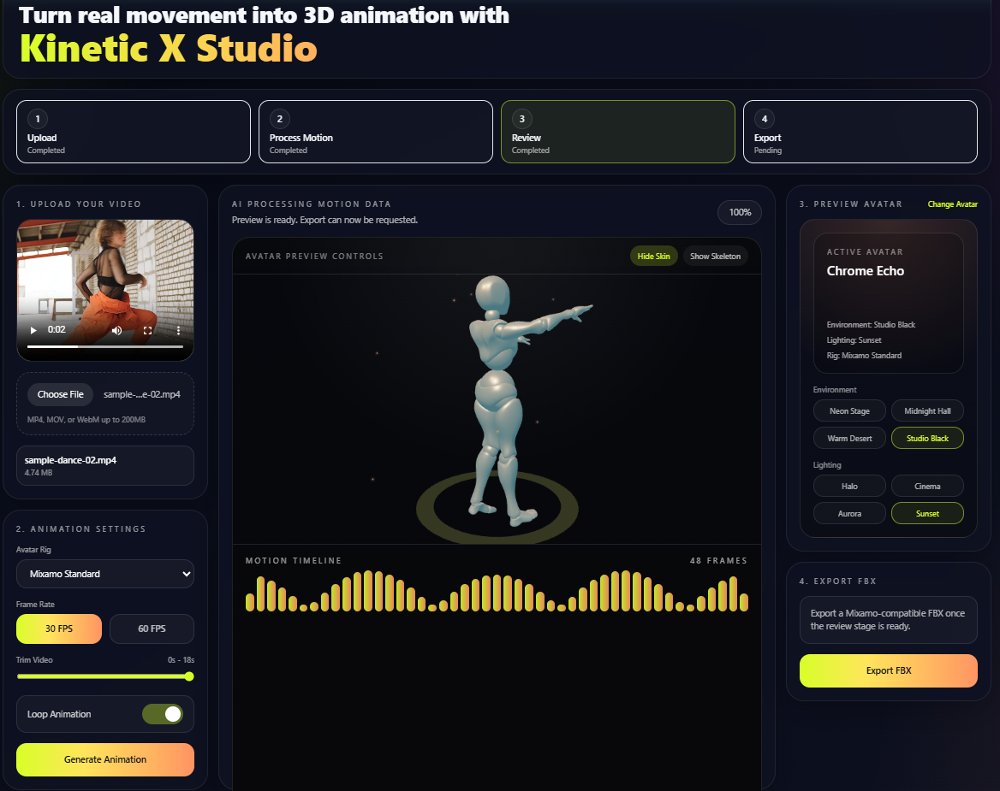

# Kinetic X Studio

Web AI Humanoid Animator - Turn any video into a reusable humanoid FBX animation clip 🕺💃

- Project Setup and Implementation details: [PROJECT.md](https://github.com/phyulwin/humanoid-motion-synthesis-fbx-generator/blob/main/PROJECT.md)
- Project Credits: [CREDIT.md](https://github.com/phyulwin/humanoid-motion-synthesis-fbx-generator/blob/main/CREDIT.md)

Test the model file - To preview the downloaded `.fbx` animation file online, use:

* Meshy FBX Viewer: [https://www.meshy.ai/3d-tools/online-viewer/fbx](https://www.meshy.ai/3d-tools/online-viewer/fbx)
* Tripo AI FBX Viewer: [https://www.tripo3d.ai/3d-tools/3d-viewer/fbx](https://www.tripo3d.ai/3d-tools/3d-viewer/fbx)

## Team

- Kelly Lwin (klwin@cpp.edu)

## Inspiration

I do game development and Blender modeling as a hobby, but creating character animations takes a lot of time. Tools like Mixamo have useful presets, but they are limited when I need custom motions like specific dances. I also do not have strong animation skills for manual keyframing. I wanted a faster way to turn real human movement into reusable animation files. That inspired me to build this project: Kinetic X Studio.

## What it does

Kinetic X Studio allows users to upload a short dance or movement video through a simple web application. The system analyzes the human motion, extracts body pose data, and converts it into a humanoid animation sequence. It then retargets that motion onto a standardized rig and exports it as a reusable FBX animation file compatible with Blender, Unity, and Unreal Engine. This helps creators, VTubers, and indie game developers generate custom animations faster without manual keyframing or expensive motion capture.

## How we built it

## Challenges we ran into

## Accomplishments that we're proud of

Built a working project that turns a short dance video into a moving 3D avatar and exports it as an FBX animation file. Created a strong MVP that clearly shows how the product helps creators save time by generating animations automatically instead of animating by hand. Successfully combined AI pose detection, K2 Think V2 reasoning, live browser preview, and Blender FBX export into one complete workflow.

## What we learned

* Keeping scope small is important
* FBX export is harder than it looks
* Retargeting motion is the hardest part
* Real pose tracking is better than fallback motion
* Small backend bugs can break the whole pipeline

## What's next for K2 Think V2

* Cloud storage and animation showcase gallery for managing saved FBX exports
* FBX sharing, collaboration, and reusable animation library support
* More avatar options, better environments, and expanded rig support for Unity, VRM, and humanoid pipelines
* Improved motion accuracy through stronger pose estimation, retargeting, and reasoning models
* More polished UX with better interactions, music, and creator-focused workflow improvements
